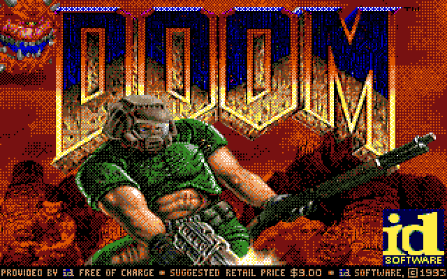
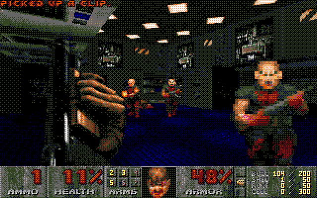

This is STDOOM, a port of DOOM to the Atari ST.

# SYSTEM REQUIREMENTS

You need an Atari ST with at least 4MB of RAM. A 16MHz machine (like the Mega STe) is recommended.
Running on an 8MHz machine should work, but is expected to be unplayably slow.

# HOW TO PLAY

- Copy the `STDOOM.TOS` executable into a folder on your ST's (real or emulated) hard drive.
  You can download the STDOOM.TOS executable here if you don't want to compile it yourself:
  https://github.com/indyjo/STDOOM/blob/master/linuxdoom-1.10/atari/stdoom.tos
- Put a WAD file like `DOOM1.WAD` next to it.
- Start `STDOOM.TOS`.
- Use keyboard or mouse for control, just as in the original game.
- If you have a system with at least a Motorola 68020 with FPU, you can use the `STDOOM20.TOS`
  executable.

# FEATURES

- Runs DOOM (and DOOM II) on Atari ST computers.
- Supports low resolution (320x200, 16 colors) and medium resolution (640x200, 4 colors).
- Zoomed mode for higher performance (activate by reducing window size using = key or menu).
- Audio sample playback using STe DMA sound.
- Music playback using the YM-2149 soundchip (work in progress).
- Controllable with keyboard and mouse.

## Not implemented

- Network gameplay

# HOW TO COMPILE

You need a C compiler and GNU Make. I recommend compiling with Thorsten Otto's Crossmint tools:
    https://www.tho-otto.de/crossmint.php

In order to compile, go into the "linuxdoom-1.10" directory, have CC point to m68k-atari-mint-gcc
and run "make".

STDOOM has the following compile-time dependencies:
- mintlib https://github.com/freemint/mintlib
- fdlibm https://github.com/freemint/fdlibm

All dependencies must be compiled with support for `-mfastcall`.

## A word on "fastcall"
STDOOM by default uses the 'fastcall' calling convention. This requires that all libraries, including
libc and libm, also support fastcall. If you find that your `STDOOM.TOS` executable crashes right
on start, try to remove `-mfastcall` from all places in the `Makefile` and recompile (after `make clean`).

# HOW TO BENCHMARK
- Rename `STDOOM.TOS` to `STDOOM.TTP`
- On start, enter parameters: `-timedemo demo3 -nosound`
- The demo plays. When it's finished, a message says:
  Error: timed 2134 gametics in x realtics
- x is the time elapsed in 1/35th of a second. Calculate FPS: 35*2134/x

# COMMAND-LINE OPTIONS
STDOOM supports the typical command-line options of the original Linuxdoom.
Additional options include:
- `-nomusic` disables YM-2149 soundchip music.
- `-nosfx` disables STe DMA sound effects. Use this to run on plain ST hardware.
- `-nosound` disables sound altogether.
